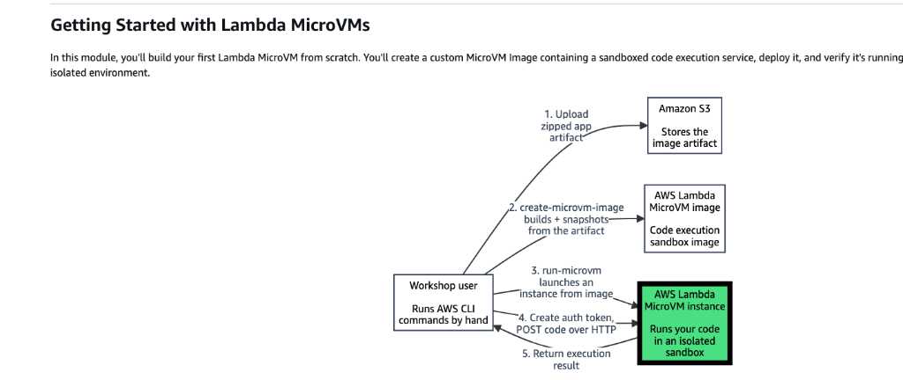
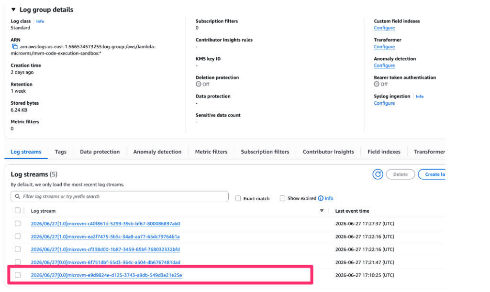
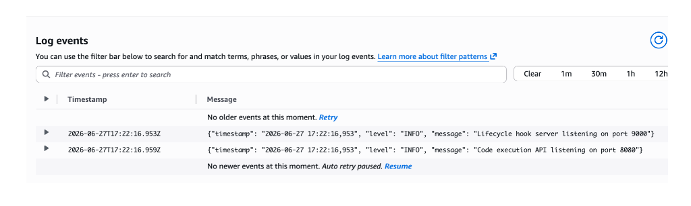
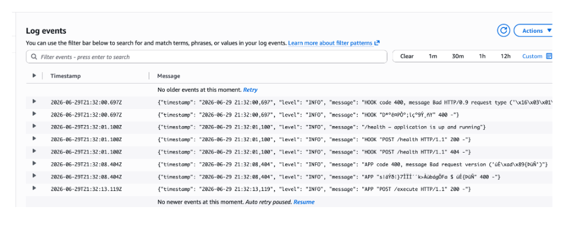
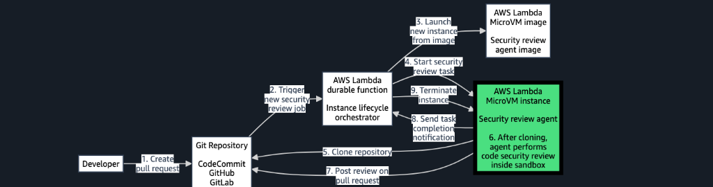
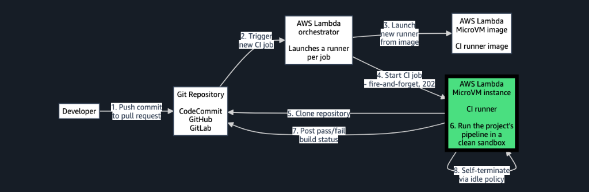

# Workshop Architecture Diagrams for Article

Here are the architecture diagrams provided during our AWS Lambda MicroVMs workshop session. You can drop these directly into your blog post or article!

### 1. Basic MicroVM Execution

**Description for Article:** 
> *The foundational architecture of an AWS Lambda MicroVM. This diagram illustrates how Firecracker snapshots are used to boot a lightweight, hardware-isolated kernel and execute an initial payload in milliseconds.*

### 2. Event-Driven Code Reviewer (Module 2)

**Description for Article:** 
> *An event-driven callback pattern. A durable orchestrator listens to Amazon EventBridge for new Pull Requests, dynamically spawns a MicroVM to execute untrusted code review logic, and handles asynchronous completion callbacks.*

### 3. Ephemeral CI/CD Runners (Module 3)

**Description for Article:** 
> *The scale-to-zero Ephemeral CI/CD architecture. Instead of paying for a standing pool of idle Jenkins or GitLab runners, an orchestrator dynamically clones the repository into a perfectly clean, isolated MicroVM sandbox that automatically self-terminates after the build.*

### 4. Multi-Tenant SaaS Control Plane (Module 4)

**Description for Article:** 
> *The Control Plane vs. Data Plane pattern for multi-tenant SaaS. An API Gateway and Lambda function act as a router to intercept incoming API traffic, map the `X-Tenant` header, and securely tunnel traffic over TLS to a dedicated MicroVM sandbox for each tenant.*

### 5. SaaS Data & Execution Isolation

**Description for Article:** 
> *Visualizing the Token Vending Machine isolation pattern. Even though the application uses a shared S3 bucket, the MicroVM generates a dynamic IAM policy (scoped to `s3://bucket/{tenant}/*`) and assumes a restricted STS session, ensuring hardware and data boundaries are cryptographically enforced.*

### 6. Dynamic IAM Session Hydration

**Description for Article:** 
> *The STS Assume Role interaction flow. The MicroVM takes the injected `X-Tenant` identifier, hydrates a JSON policy template, and fetches restricted, temporary AWS credentials to lock down the application's blast radius.*
